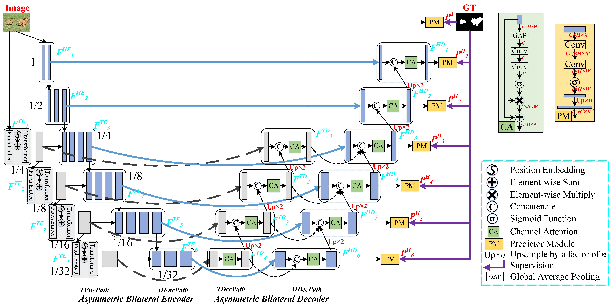
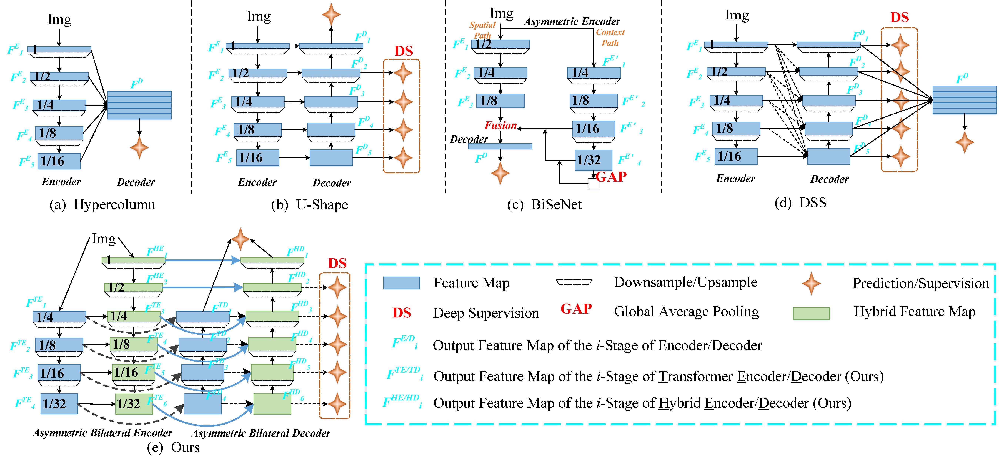

## Boosting Salient Object Detection with Transformer-based Asymmetric Bilateral U-Net

This code is licensed for non-commerical research purpose only.

### Introduction

Existing salient object detection (SOD) methods mainly rely on CNN-based U-shaped structures with skip connections to combine the global contexts and local spatial details that are crucial for locating salient objects and refining object details, respectively. Despite great successes, the ability of CNN in learning global contexts is limited. Recently, the vision transformer has achieved revolutionary progress in computer vision owing to its powerful modeling of global dependencies. However, directly applying the transformer to SOD is suboptimal because the transformer lacks the ability to learn local spatial representations. To this end, this paper explores the combination of transformer and CNN to learn both global and local representations for SOD. We propose a transformer-based Asymmetric Bilateral U-Net (ABiU-Net). The asymmetric bilateral encoder has a transformer path and a lightweight CNN path, where the two paths communicate at each encoder stage to learn complementary global contexts and local spatial details, respectively. The asymmetric bilateral decoder also consists of two paths to process features from the transformer and CNN encoder paths, with communication at each decoder stage for decoding coarse salient object locations and fine-grained object details, respectively. Such communication between the two encoder/decoder paths enables AbiU-Net to learn complementary global and local representations,taking advantage of the natural properties of transformer and CNN, respectively. Hence, ABiU-Net provides a new perspective for transformer-based SOD. Extensive experiments demonstrate that ABiU-Net performs favorably against previous state-of-the-art SOD methods.





### Citations

If you are using the code/model provided here in a publication, please consider citing:
   
@article{qiu2021boosting,
  title={Boosting Salient Object Detection with Transformer-based Asymmetric Bilateral U-Net},
  author={Qiu, Yu and Liu, Yun and Zhang, Le and Xu, Jing},
  journal={arXiv preprint arXiv:2108.07851},
  year={2021}
}

### Requirements

The code is built with the following dependencies:

- Python 3.6 or higher
- CUDA 10.0 or higher
- [PyTorch](https://pytorch.org/) 1.2 or higher

### Data Preparation

*The SegLesion dataset is organized into the following tree structure:*
```
dataset
│
└───DUTS-TR
└───DUTS-TR.lst
└───SOD
└───SOD.lst
└───HKU-IS
└───HKU-IS.lst
'''
```


### Testing
Run the following scripts to test the model:
```
CUDA_VISIBLE_DEVICES=0 python test.py [--model_name 'ABiU-Net']
                [--savedir 'outputs']
                [--pretrained './result_epoch50/ABiU_Net_50.pth']
```


### Evaluate
The output saliency maps can be downloaded:
- [SOD](https://drive.google.com/file/d/1x0uVY-MFz2o0Ymlm0hpYyYqlZeXD9KSY/view?usp=sharing)
- [HKU-IS](https://drive.google.com/file/d/1EeUU8hUZmjs80Bdon1WOW2AkRn07QG0f/view?usp=sharing)
- [ECSSD](https://drive.google.com/file/d/1tfDuYEtneCuy7o8pIMvcuvzPwmVVNbrC/view?usp=sharing)
- [DUT-OMRON](https://drive.google.com/file/d/149bV1eoKKOwWKwa2GlVAkkvSY2ZV2CZ5/view?usp=sharing)
- [THUR15K](https://drive.google.com/file/d/1FTZpW-92S7S-1E-bfSWOAcwawrWdCNJW/view?usp=sharing)
- [DUTS-TE](https://drive.google.com/file/d/1lzYCzO6T-P2M9Krz9kdqLF7KOyxY7phq/view?usp=sharing)

Run the following scripts to evaluate the model:
```
python evaluate.py
```

### Training
The pretrained PVT-Tiny can be downloaded:
- [PVT-Tiny](https://drive.google.com/file/d/1BYalud8jo6u7Whh305bRzzWJNVX4yL__/view?usp=sharing)

Run the following scripts to train the model:

```
CUDA_VISIBLE_DEVICES=0 python test.py [--model_name 'ABiU-Net']
                [--max_epochs 50]
                [--batch_size 16]
                [--base_lr 5e-5]
                [----img_size 384]
```

### Contact

For any questions, please contact me via e-mail: yqiu@mail.nankai.edu.cn.
